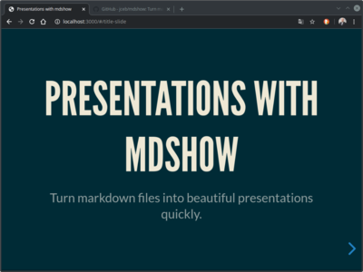

# `mdshow`

> Turn markdown files into beautiful presentations quickly.

`mdshow` is built to quickly turn ideas into beautiful presentations.

The tool of choice for capturing ideas is the text-based
[Markdown](https://daringfireball.net/projects/markdown/) format. The
heavy lifting of making text beautiful is left to
[reveal.js](https://revealjs.com/), a popular web presentation framework.
`mdshow` does the work in between of turning text into a presentation.

[](https://youtu.be/ZNXvQGsk_wA)

- [Introduction video to mdshow](https://youtu.be/ZNXvQGsk_wA)
- [Example HTML presentation](https://mdshow.e-jc.de/)
- [Example PDF](./examples/slides.pdf)
- [Example Markdown](https://raw.githubusercontent.com/jceb/mdshow/master/examples/slides.md)

## Table of Contents

- [Features](#features)
- [Background](#background)
- [Install](#install)
- [Usage](#usage)
- [Maintainers](#maintainers)
- [Contributing](#contributing)
- [License](#license)

## Features

- Built with [reveal.js 4.0](https://revealjs.com/) and [pandoc
  2.9](https://pandoc.org/)

### Focus

- Minimally invasive. All data is kept in `slides.md`, `assets/`, and a
  temporay `.build/` folder
- Markdown as the sole markup to focus on

### Enterprise

- Custom themes and reuse of themes across all presentations
- Default settings across all presentations
- Custom settings per presentation
- Live-reload of changes
- PDF conversion

### Setup

- Scaffolding for a quick start (run `mdshow scaffold` to create )
- Auto-generated title slide
- Usable default settings

### Presentation

- [Font Awesome](https://fontawesome.com/) integration
- Multiple columns per slide
- Syntax highlighting for source code
- Incremental display of bullet points and other fragments
- Zoom into slide (press `<Alt-Left Mouse Button>` or `<Ctrl-Left Mouse
  Button>` to zoom)
- Separate speaker notes view (press `<s>` to show)
- Slide overview and navication (press `<Esc>` to enter overview and
  `<Esc>` to show selected slide)

## Background

I've been using various markup formats like org-mode, asciidoc and
markdown extensively and for professional purposes, e.g. writing a
thesis, publishing documentation or keeping notes. However, for
presentations I usually revert back to MS PowerPoint and Libreoffice
Impress although web browsers are obviously way better at presenting
content!

While PowerPoint & Co. get the job done, plain text is so much faster
and more usable to me. For example, I can keep it in a repository to
track revisions + use all the git infrastructure that exists around
sharing content.

While plain text is faster, I had a hard time finding tools that would
make it easy for me to concentrate on creating content. Furthermore, the
*speed* of tools is very important to me. On the side of functionality I
value *theming*, esp. across multiple presentations as well as *no
clutter* in my presentation directory.

I took lots of inspiration from
[markdeck](https://github.com/arnehilmann/markdeck) that I've been using
successfully for a few years. I like the full-featured approach of
markdeck and aim to bring many of its features to `mdshow` following an
opinionated path.

## Install

### Prequisites

- `autoconf`
- `automake`
- `curl`
- `g++`
- `gcc`
- `make`
- `pandoc`, suggest version 2.9.x
- `unzip`

### Installation

Download the program:

```
curl -LO https://raw.githubusercontent.com/jceb/mdshow/master/mdshow
```

Copy the `mdshow` program to a directory in `$PATH` and make it
executable:

```
chmod a+x mdshow
```

Test and download dependencies:

```
mdshow setup
```

## Usage

Create a new presentation in a new directory:

```
mdshow scaffold
```

The command will create a `slides.md` file and an `assets` directory.
Place all assets like pictures in the `assets` directory. The content of
the presentation lives in `slides.md`.

Display the presentation in a [browser](http://localhost:3000) with
live-reload:

```
mdshow serve
```

If you want to use a different file name pass it to mdshow via the
`SLIDES` paramter:

```
mdshow serve SLIDES=custom.md
```

Convert the presentation to a PDF file (make sure `mdshow serve` is
running before executing the following command):

```
mdshow pdf
```

More commands and information:

```
mdshow help
```

## Maintainers

[@jceb](https://github.com/jceb)

## Contributing

PRs accepted.

Small note: If editing the README, please conform to the [standard-readme](https://github.com/RichardLitt/standard-readme) specification.

## License

Apache-2.0 2020 Jan Christoph Ebersbach
